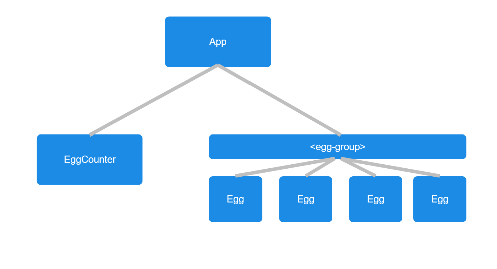

# Frontend Conventions Guide

## About
This file is a guide containing the general conventions I have for consistent frontend development. Note that we are using a class component-based architecture, but we are *not* using native web components, as their syntax is verbose and hard to work with (in my opinion).

This guide will reference the sample webapp in `src/sample` as an example of how I generally expect things to be done in practice.

If you have any questions/feedback/suggestions, feel free to bring them up in the `#team-2` channel in Slack.

## Components

Broadly, components are a way to define the interactivity of our app in an encapsulated manner, while generally adhering to the semantics of HTML/CSS/JS. That is, HTML adds structure, CSS adds styles to HTML, and JS adds interactivity to HTML+CSS.

To achieve this goal, all components will have a base HTML template that they bind to. This template serves as the 'contract' for this component; it must be present in the HTML when the component is instantiated for it to function correctly. 

All components will lie in the `/components` directory, and will be named in PascalCase. Let's take a look at `/components/App.js` for an example of our first component.

We declare the component and mark it for export with
```js 
export default class App { 
``` 

The JSDocs for this component establishes the template the App component expects to function correctly.

```js 
/** 
 * The main component for the app.
 * 
 * Expects the following minimal HTML structure:
 * <div class="app">
 *   <div class="egg-group"></div>
 *   <EggCounter class="egg-counter"/>
 * </div>
 */
```

A few rules for these templates:
1. Templates must have a single root element (in this case, the `div` with class `app`)
2. If a template uses another component, mark the component with its name (e.g. `<EggCounter/>`)
3. Prefer using classes over IDs in templates
    1. This helps components stay reusable.

You will notice that this structure is present in our HTML file, as follows: 

```html
<!-- App -->
<div class="app">
  <!-- EggCounter -->
  <div class="egg-counter">
      <span class="egg-counter-text">Eggs: 0</span>
      <button class="egg-counter-decrement">-</button>
      <button class="egg-counter-increment">+</button>
  </div>

  <div class="egg-group"></div>
</div>
```

Templates are minimal requirements, so feel free to customize them however you like (e.g. adding more classes or styles).

Our App takes in a constructor, which binds the app to its root HTML element in our document. 

```js
/**
 * Binds this App to the given element.
 * @param {HTMLElement} element
 */
constructor(element) {
    this.element = element;
    this.eggGroupElement = assertHTMLElement(this.element.querySelector('.egg-group'));
    this.eggCounter = new EggCounter(assertHTMLElement(this.element.querySelector('.egg-counter')));
    this.eggCounter.onUpdateCount((newCount) => this.handleUpdateCount(newCount));
}
```

We call this constructor in our `ui.js` file to mount our app.

```js
/** @type {App} */
let app;
function main() {
    const appElement = assertHTMLElement(document.querySelector('.app'));
    app = new App(appElement);
}
document.addEventListener('DOMContentLoaded', main);
``` 

Components will usually interact with the DOM by changing attributes, properties, or text. However, some components may need to modify the DOM by creating and deleting DOM elements.  
- We will maintain the convention that the component creating a DOM element is the one responsible for deleting it when it is done being used. 

### Component Trees

Note that component classes can have other components as variables. For instance, `App` has an `EggCounter` subcomponent that it instantiates in its constructor.

```js
this.eggCounter = new EggCounter(assertHTMLElement(this.element.querySelector('.egg-counter')));
this.eggCounter.onUpdateCount((newCount) => this.handleUpdateCount(newCount));
```

This pattern of having components contain other subcomponents creates a component tree. Here is the component tree for our sample project:


There are a few conventions to keep in mind when working with component trees.
1. Component tree structure should match HTML structure.
    1. This is useful for encapsulation, but it also maintains code semanticity when root elements call `querySelector`.
2. State shared between a set of components should either (1) be global state or (2) be 'lifted' up to the least common ancestor of that set.
3. Information flow is regulated, as follows:
    1. Information going from parent $\to$  child should be passed through properties or child function calls (e.g. `child.doStuff()`)
    2. Information going from child $\to$ parent should be passed through callbacks (e.g. parent calls `child.onClick(callback)`)

### Reactivity

We want components to be *reactive*. That is, changing their properties or calling their public functions will keep the component in a valid state.

As an example, running

```js
eggCounter.count++
```
should automatically rerender the component to change its display text without needing to do anything else. 

This behavior can be achieved by leveraging JS getter and setter functionality. We can look at the code for `eggCounter` to see an example of this.

```js
/**
 * Sets the current egg count and updates the display.
 * @param {number} newCount
 */
set count(newCount) {
    this.#count = newCount;
    this.counterText.textContent = `Eggs: ${this.#count}`;
}
```

We mark the backing field of this component, `#count`, as a natively private JS variable to hide it. Then, the setter is able to update `#count` and change the displayed text at the same time, maintaining reactivity.

Again, we will maintain conventions for reactivity:
1. All public properties and methods should be reactive
    1. Private properties and methods are not necessarily reactive, but they can be
2. Reactivity only affects a component's subtree
    1. To prevent loops, reactivity should never trigger callbacks to parent components. The code structure should be reworked to have the least common ancestor (or a global object) handle such cases.

### Sample Information Flow

We can walk through our code to get a sense of how our components manage data.

1. Initialization:
    1. Our `main` function executes and mounts our `App`. 
    2. In the constructor, our `App` initializes its template dependencies `eggGroupElement` and `eggCounter`.
    3. `App` provides a callback for the `onUpdateCount` of `eggCounter`.
2. When the user presses the `+` button:
    1. The `eggCounter` receives an event on the increment button, which calls `callback(this.count + 1)`, thus passing state up the component tree.
    2. `App`'s callback was `handleUpdateCount(newCount)`. This then runs `addEgg` to add an egg to the display.
    3. In `addEgg`, the function creates a new `span` element, and binds an `Egg` component to it. This `Egg` is stored in a list for future access.
3. When the user presses the `-` button:
    1. A similar process as the `+` button occurs, the only exception being that `App` calls `removeEgg` instead.
    2. In `removeEgg`, the function pops the last `Egg` from the stored list and unmounts it. 

## HTML

All components occurrences in the HTML should have a comment before them that marks which component it is, as follows:
```html
<!-- EggCounter -->
<div class="egg-counter">
    <span class="egg-counter-text">Eggs: 0</span>
    <button class="egg-counter-decrement">-</button>
    <button class="egg-counter-increment">+</button>
</div>
```

HTML elements and their locations should be semantic (e.g. using a `span` for text, placing `<script>` tags in the `head`).

If possible, the initial text value of HTML elements should match whatever their initial mount value is (or at least have meaningful placeholder text).

## CSS

### General Guidelines:
CSS is powerful. Try to opt for natural CSS solutions instead of using more DOM elements or JS, whenever possible.
- Most animations should be handled entirely by CSS.
- Use better CSS settings instead of having wrapper DOM elements for positioning.

Follow natural specificity conventions, if possible.

### Styling

In general, try to use classes for styling. Elements with the same parent should have similar prefixes for their primary class, as shown in the `EggCounter` component:
```html
<!-- EggCounter -->
<div class="egg-counter">
    <span class="egg-counter-text">Eggs: 0</span>
    <button class="egg-counter-decrement">-</button>
    <button class="egg-counter-increment">+</button>
</div>
```

Using IDs for styling should be used sparingly. Only use IDs when it is guaranteed that exactly one element has that ID. 

Using complex selectors is allowed, but try not to overuse them; only using classes is often cleaner.

### Interacting with JS

Editing the class list of an element will be the standard way that JS modifies styles.

Updating CSS variables is another option, but only use it whenever it makes sense in context (e.g. theming).

## JS

All classes and functions should have JSDocs documentation.

All variables should be as precisely typed as possible, such as preferring `ClassName` over `ClassName | null`
- Also applies to callbacks, e.g. `(value: number) => void`
- All functions should have clear input/output types

Mark variables/functions with the correct JSDocs visibility (e.g. `@private`)

Use JS modules with import/export syntax
- Classes should use `export default` 
- Functions should only use `export`
